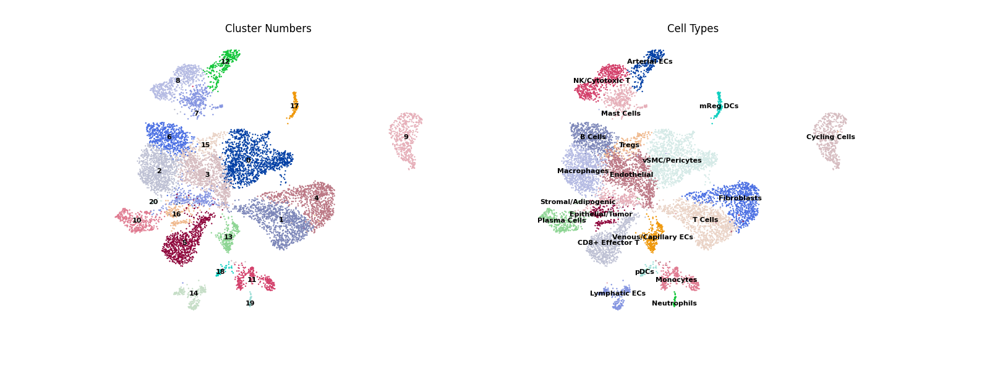

# GEO 数据集检索与整理

## 背景
**红光对近视的相关影响**（聚焦 **AMPK 通路** 与 **线粒体功能**，重点关注近视相关组织：巩膜/脉络膜/视网膜等）。


## 文件结构

```text
.
├─ Articles/                                # 参考文献
├─ Datasets/                                # 按检索主题分组的数据与记录
│  ├─ 1_Red_light_Tissues/                  # 检索主题 1：红光 × 组织
│  │  ├─ 1_Red light And Tissues.csv        # 检索命中的 GSE 列表
│  │  ├─ High/                              # 依据评估表分类
│  │  ├─ Medium/
│  │  └─ Low/
│  ├─ 2_Myopia_RedLight/                    # 检索主题 2：近视 × 红光
│  │  ├─ 2_Myopia AND Red_light.csv
│  │  ├─ High/
│  │  ├─ Medium/
│  │  └─ Low/
│  └─ 3_Myopia_Tissues/                     # 检索主题 3：近视 × 组织
│     ├─ 3_Myopia And Tissues.csv
│     ├─ High/
│     ├─ Medium/
│     └─ Low/
├─ Images/                                  # 图片与结果展示
│  └─ Figure_1.png
├─ Scripts/                                 # 主要脚本
│  ├─ GEO_fetch.py                          # GEO 检索与下载（GDS→GSE）
│  ├─ sort_gse.py                           # 依据评估表进行归类
│  ├─ geo_scanpy_pipeline.py                # 批处理单细胞数据（Scanpy）
│  ├─ UMAP.py                               # UMAP + marker 验证绘图
│  └─ download.py                         
├─ query.py                                 # GEO_fetch 的使用示例
├─ 细胞标记基因.md                           # 细胞类型 marker 笔记
├─ GEO_dataset_evaluation_UPDATED.csv       # 人工评估主表
├─ 论文总结.md
├─ 方法分类与汇总.md
└─ README.md
```


### `GEO_dataset_evaluation_UPDATED.csv`（核心索引表）
该表是“可用数据集清单”的唯一来源，用于把候选 GSE 变成结构化的、可落地分析的数据集集合。

关键列：
- `Group`：对应 `Datasets/<Group>/`（三种检索之一）
- `GSE`：GEO Series 编号（例如 `GSE22818`）
- `Suitability_Level`：`High / Medium / Low`（用于自动分文件夹）
- `Assessment`：定性判断（如 Highly relevant / Marginal / Not relevant）
- `Notes`：补充信息

## 检索设计
三类检索是为了从不同角度构建候选数据集池。

### 1) `1_Red_light_Tissues`：红光 × 眼相关组织
目的：
- 收集“红光/光疗”对眼组织分子响应的转录组数据
- 可能需要对照：红光效应是否为普遍光生物学反应，还是与近视模型有特异交互

检索式：
```text
(retina OR choroid OR sclera OR ocular)
AND
("red light" OR "phototherapy")
```

### 2) `2_Myopia_RedLight`：近视 × 红光
目的：
- 直接定位“近视模型 + 红光干预”的数据集
- 评估红光是否影响近视相关表达谱
- 实际 GEO 命中较少，因此需要单独作为一组持续补漏

检索式：
```text
(myopia OR "form deprivation" OR lens-induced)
AND
("red light" OR "phototherapy")
```

### 3) `3_Myopia_Tissues`：近视 × 眼相关组织
目的：
- 构建近视相关组织的基本交互机制
- 提取近视核心分子特征（巩膜 ECM 重塑、炎症/代谢改变、线粒体相关信号等）
- 为后续与红光数据集做交集分析/模块比对提供基础：例如“红光是否逆转近视特征模块/通路”

检索式：
```text
(myopia OR "form deprivation" OR lens-induced)
AND
(retina OR choroid OR sclera OR ocular)
```

## 脚本功能

### `Scripts/GEO_fetch.py`
- 方便快速从 GEO 检索到候选 GSE，并下载对应文件。
- 核心类：`GEOConfig`、`GEOFetcher`，可下载 `matrix` / `soft` / `raw`（GSE_RAW.tar）。
- 输出：一份包含 Title/Summary/Organism/Platforms/SOFT链接等的 CSV。

### `query.py`
- `Scripts/GEO_fetch.py` 的使用示例，展示如何填写 query、email、download_types 等配置后运行检索。

### `Scripts/sort_gse.py`
- 读取 `GEO_dataset_evaluation_UPDATED.csv`，把下载的 GSE 文件按 `Suitability_Level` 归类到 High/Medium/Low。
- 提示：当前脚本内 CSV路径与目标路径是硬编码（Windows 绝对路径），使用前需根据你的目录修改。

## 单细胞分析（Scanpy）

### `Scripts/geo_scanpy_pipeline.py`
- 对 `DATASET_ROOT` 下的每个 `GSE*/` 文件夹进行批处理：读取 h5ad / 10x h5 / 10x mtx，基础 QC、过滤、PCA、Neighbors、UMAP、Leiden聚类。
- 输出到 `OUT_ROOT`：保存 `processed.h5ad`、QC 指标、marker 结果和汇总 `dataset_summary.csv`。

### `Scripts/UMAP.py`
- 读取一个指定的 `.h5ad`，将 `leiden` cluster 映射为细胞类型，绘制 UMAP，并用 dotplot 验证 marker。
- 提示：路径与 cell_type_map 是脚本内配置，需按实际数据修改。


## 其他笔记
- `细胞标记基因.md`：Retina/Choroid/Sclera 常用 marker，便于单细胞注释与污染排查。
- UMAP 示例图：


